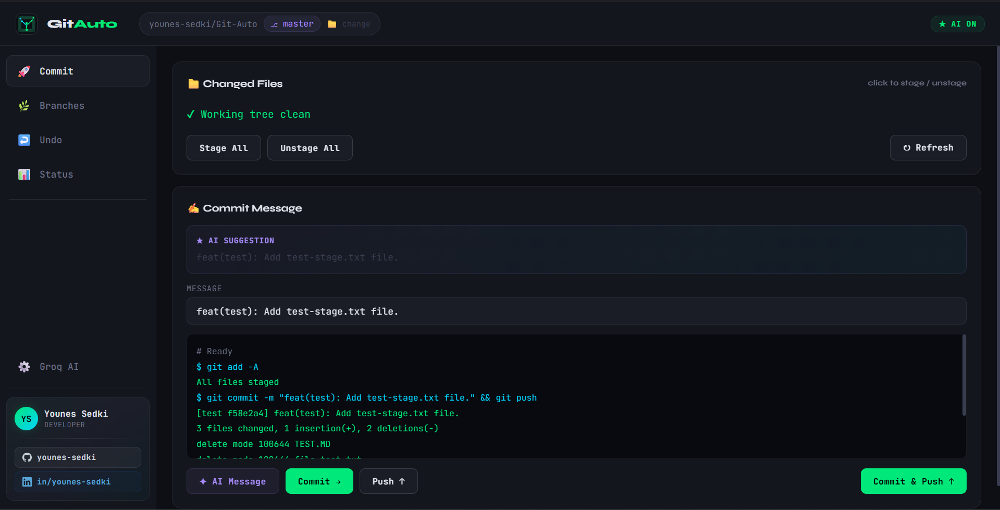
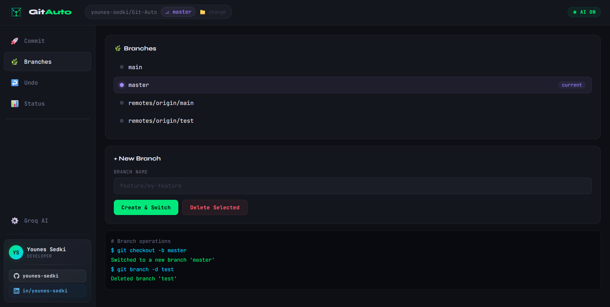
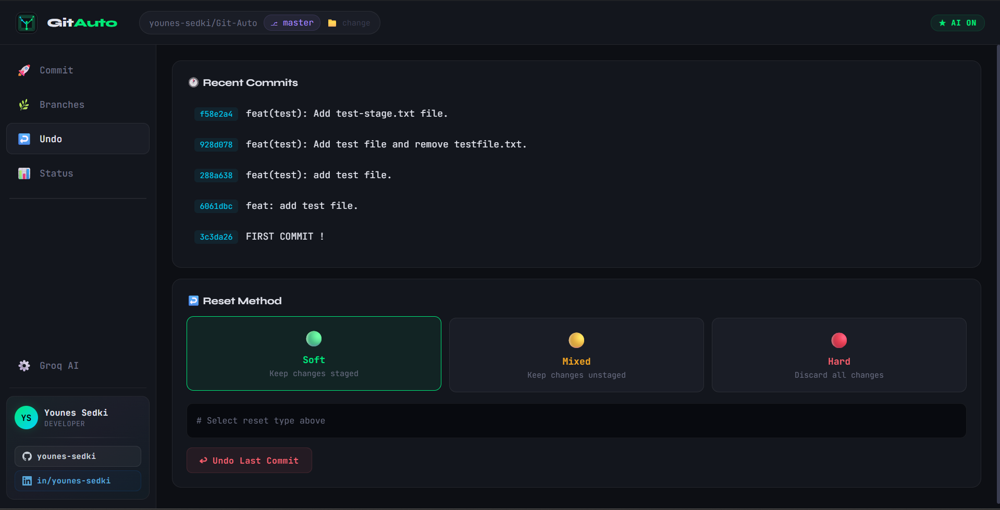
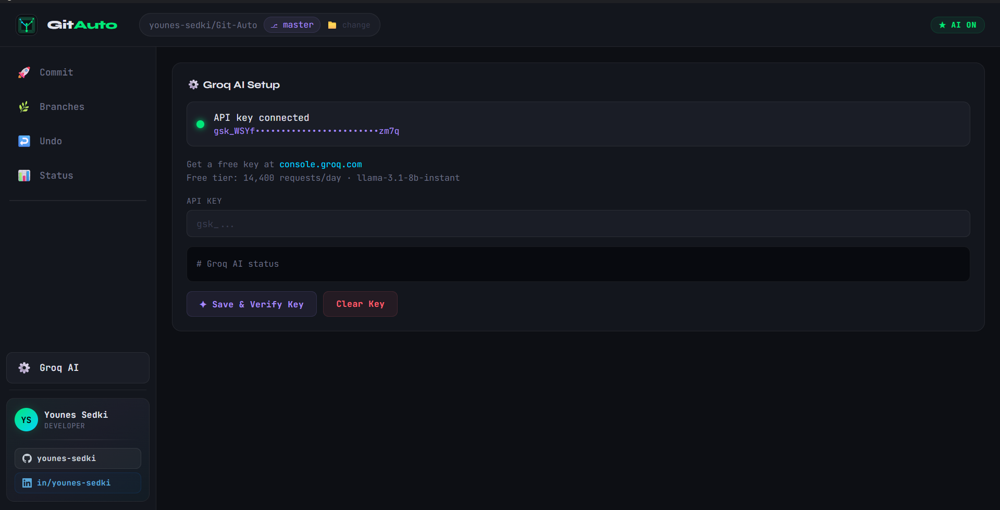

# Git Auto

A lightweight desktop Git client with an AI-powered commit message generator, built with Python + pywebview. No Electron, no Node.js — just a single Python file that renders a native desktop window around a self-contained HTML/CSS/JS interface.


---

## Features

- **Commit panel** — view changed files, stage/unstage individually or all at once, write and submit commit messages
- **AI commit messages** — sends your staged diff to the Groq API (llama-3.1-8b-instant) and generates a conventional-commits message in one click
- **Push** — push to origin directly from the UI, with automatic upstream tracking on first push
- **Branch management** — list local and remote branches, create, switch, and delete (with force-delete fallback)
- **Undo commits** — soft, mixed, or hard reset of the last commit with a visual selector
- **Status dashboard** — live stats (commits, changed files, stashes), full `git status` output, and recent commit log
- **Folder picker** — switch the active repository at runtime without restarting

---

## Screenshots

> _Replace the images below with your own screenshots._

| Commit Panel | Branch Manager |
|---|---|
|  |  |

| Undo / Reset | Groq AI Setup |
|---|---|
|  |  |

Place your screenshots in `assets/screenshots/` and name them `commit.png`, `branches.png`, `undo.png`, and `groq.png` — or update the paths above to match your own filenames.

---

## Requirements

- Python 3.8+
- [pywebview](https://pywebview.flowrl.com/) `>= 4.0`
- [requests](https://docs.python-requests.org/) (optional — required only for AI messages)

```
pip install pywebview requests
```

> **Platform notes**
> - **macOS**: pywebview uses WebKit; works out of the box.
> - **Windows**: uses the built-in EdgeHTML/WebView2; `.ico` icon support is included.
> - **Linux**: requires `gtk3` or `qt` extras — e.g. `pip install pywebview[gtk3]`.

---

## Installation

```bash
git clone https://github.com/your-username/git-auto
cd git-auto
pip install pywebview requests
python app.py
```

The app launches in the directory you run it from, so `cd` into any Git repo first — or use the **📁 change** button in the titlebar to pick a folder after launch.

---

## AI Commit Messages (Groq)

Git Auto uses the [Groq API](https://console.groq.com) to generate commit messages. Groq's free tier allows **14,400 requests/day** using `llama-3.1-8b-instant`.

### Setup

1. Go to [console.groq.com](https://console.groq.com) and create a free API key.
2. Open the **⚙️ Groq AI** panel inside Git Auto.
3. Paste your key (`gsk_...`) and click **Save & Verify Key**.

The key is validated against the live API before saving. It is stored in `~/.gitauto_groq_key` and can also be set via the `GROQ_API_KEY` environment variable (takes precedence over the file).

### Clear the key

Click **Clear Key** in the Groq AI panel, or delete `~/.gitauto_groq_key` manually.

---

## Optional Assets

Place these files in an `assets/` folder next to `app.py` to use your own branding:

| File | Purpose |
|---|---|
| `assets/logo.png` | Titlebar logo (28 × 28 px recommended) |
| `assets/app-icon.png` | Taskbar / dock icon |
| `assets/app-icon.ico` | Windows titlebar icon |

If no assets are found, a built-in SVG icon is used automatically.

---

## Project Structure

```
git-auto/
├── app.py          # Everything — Python backend + embedded HTML/CSS/JS
└── assets/         # Optional branding assets
    ├── logo.png
    ├── app-icon.png
    └── app-icon.ico
```

The entire UI is embedded as a Python string inside `app.py`. There are no external HTML, CSS, or JS files.

---

## How It Works

`app.py` has two main parts:

**Python backend (`GitAPI` class)** — exposed to JavaScript via `pywebview.api`. Each method runs a `git` subprocess in the current working directory and returns a plain dict that the frontend reads.

**Frontend (HTML/CSS/JS string)** — a single-page app rendered inside the native webview. JavaScript calls `pywebview.api.<method>()` (async, returns a Promise) to talk to the Python side.

---

## Keyboard Shortcuts

There are no global keyboard shortcuts at this time. All actions are triggered via the UI buttons.

---

## Troubleshooting

**"requests not installed"** — run `pip install requests` and restart.

**AI button does nothing / "No changes to analyze"** — make sure you have staged files before generating a message. If the working tree is completely clean the diff is empty.

**Window doesn't open on Linux** — install the GTK or Qt extras for pywebview:
```bash
pip install pywebview[gtk3]
# or
pip install pywebview[qt]
```

**Push fails** — the app tries `git push origin <branch>` and falls back to `git push --set-upstream origin <branch>` automatically. If it still fails, check your remote credentials.

---

## License

MIT